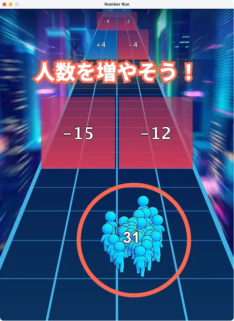

# レーン上で走って数字増やしていくハイパーカジュアルゲームクローン

広告でよく見かける、レーン上を走りながら数字を増やしていくゲーム。

## ゲーム概要・スクリーンショット

<p align="center">
  
  
</p>

<p align="center">
  
  
</p>

## ダウンロード・実行

[GitHub の Releases](https://github.com/MPro-HC/number-run/releases) からビルド済みの `.jar` をダウンロードできます。

ダウンロードした `.jar` に対して以下のように実行することでゲームを起動できます。


```bash
java -jar app.jar
```


## 手元でビルドする場合

要件: Java バージョン >=v25 (IED ではビルドできなかった)

### Linux & macOS

`git clone` したのち、ルートディレクトリで

```bash
./gradlew
```

`.jar` を作成する場合は、

```bash
./gradlew :app:jar
```

実行すると `app/build/libs/app.jar` が作成されます。

### Windows 


`git clone` したのち、ルートディレクトリで

```bash
./gradlew.bat
```

`.jar` を作成する場合は、

```bash
./gradlew.bat :app:jar
```

実行すると `app/build/libs/app.jar` が作成されます。

