# Number Run クラス図

このプロジェクトは**ECS（Entity Component System）**アーキテクチャを採用しています。

## アーキテクチャ概要

- **Entity**: コンポーネントのコンテナ
- **Component**: データのみを保持（ロジックなし）
- **System**: ゲームロジックを実装
- **World**: EntityとSystemを管理

## クラス図

```mermaid
classDiagram
    %% Core Classes
    class App {
        +main(String[] args)
    }
    
    class GameEngine {
        -String title
        -int width
        -int height
        -World world
        -InputState inputState
        -JFrame frame
        -Canvas canvas
        -boolean running
        -int targetFps
        +getWorld() World
        +getInputState() InputState
        +start()
        +stop()
    }
    
    class SoundManager {
        +playSound()
        +stopSound()
    }
    
    %% System Package
    class World {
        -List~Entity~ entities
        -List~GameSystem~ systems
        +spawn(Component...) Entity
        +addSystem(GameSystem) World
        +addSystems(GameSystem...) World
        +query(Class) List~Entity~
        +getAllEntities() List~Entity~
        +update(float deltaTime)
        +render(Graphics g)
        +handleInput(InputEvent, InputState)
    }
    
    class Entity {
        -long id
        -Map~Class, Component~ components
        -List~Entity~ children
        -Entity parent
        -boolean active
        +addComponent(Component) Entity
        +getComponent(Class) Optional~Component~
        +hasComponent(Class) boolean
        +removeComponent(Class)
        +setActive(boolean)
        +destroy()
    }
    
    class GameSystem {
        <<interface>>
        +getPriority() int
        +update(World, float)
        +onInput(World, InputEvent, InputState)
        +onStart(World)
        +onStop(World)
    }
    
    %% Component Package
    class Component {
        <<interface>>
    }
    
    class Renderable {
        <<interface>>
        +render(Graphics)
        +getZOrder() float
        +setZOrder(float)
        +getWidth() float
        +getHeight() float
    }
    
    class Transform {
        -float x
        -float y
        -float rotation
        -float scaleX
        -float scaleY
        +getX() float
        +setX(float)
        +getY() float
        +setY(float)
        +setPosition(float, float)
    }
    
    class Velocity {
        -float vx
        -float vy
        +getVx() float
        +getVy() float
    }
    
    class Image {
        -BufferedImage image
        -float width
        -float height
        -float zOrder
        +render(Graphics)
    }
    
    class Text {
        -String text
        -Font font
        -Color color
        +render(Graphics)
    }
    
    class Rectangle {
        -Color color
        -float width
        -float height
        +render(Graphics)
    }
    
    class Circle {
        -Color color
        -float radius
        +render(Graphics)
    }
    
    class Sprite {
        -BufferedImage image
        -float width
        -float height
        +render(Graphics)
    }
    
    class Timer {
        -float time
        +update(float delta)
    }
    
    %% Game Package - Scene
    class Scene {
    }
    
    class SceneState {
        -SceneType type
        +getType() SceneType
        +setType(SceneType)
    }
    
    class SceneType {
        <<enumeration>>
        GAMEPLAY
        GAME_OVER
    }
    
    %% Game Package - Player
    class PlayerState {
        -int lane
        -int value
        +getLane() int
        +getValue() int
    }
    
    class PlayerView {
        -float width
        -float height
        +render(Graphics)
        +setupInitialPlayer(World)
    }
    
    class PlayerMovementSystem {
        +update(World, float)
        +onInput(World, InputEvent, InputState)
    }
    
    class PlayerPassWallSystem {
        +update(World, float)
    }
    
    class PlayerViewSyncSystem {
        +update(World, float)
    }
    
    %% Game Package - Level
    class Level {
        -int level
        -float speed
        +getLevel() int
        +incrementLevel()
    }
    
    class LevelSystem {
        +update(World, float)
    }
    
    %% Game Package - Lane
    class LaneView {
        -int width
        -int height
        +render(Graphics)
    }
    
    class LaneMappingSystem {
        +update(World, float)
    }
    
    class LaneMovementSystem {
        +update(World, float)
    }
    
    %% Game Package - Wall
    class Wall {
        -int value
        -int lane
        +getValue() int
        +getLane() int
    }
    
    class WallView {
        +render(Graphics)
    }
    
    %% Game Package - Grid
    class GridLine {
        -float y
    }
    
    class GridLineSpawnSystem {
        +update(World, float)
        +setupInitialLines(World, LaneView)
    }
    
    %% Game Package - GameOver
    class GameOverSystem {
        +update(World, float)
    }
    
    class GameOverExitSystem {
        +update(World, float)
        +onInput(World, InputEvent, InputState)
    }
    
    class GameOverAdSystem {
        +update(World, float)
    }
    
    %% Game Package - Effects
    class DamageEffectSystem {
        +update(World, float)
    }
    
    class PowerUpEffectSystem {
        +update(World, float)
    }
    
    %% Game Package - Animation
    class SpriteAnimationSystem {
        +update(World, float)
    }
    
    %% Game Package - Cursor
    class GlobalCursorSystem {
        +update(World, float)
        +onInput(World, InputEvent, InputState)
    }
    
    %% Relationships - Core
    App --> GameEngine : creates
    GameEngine --> World : has
    GameEngine --> SoundManager : uses
    
    %% Relationships - System
    World --> Entity : manages
    World --> GameSystem : executes
    Entity --> Component : contains
    
    %% Relationships - Components
    Renderable --|> Component : extends
    Transform ..|> Component : implements
    Velocity ..|> Component : implements
    Image ..|> Renderable : implements
    Text ..|> Renderable : implements
    Rectangle ..|> Renderable : implements
    Circle ..|> Renderable : implements
    Sprite ..|> Renderable : implements
    Timer ..|> Component : implements
    Scene ..|> Component : implements
    SceneState --> SceneType : uses
    SceneState ..|> Component : implements
    
    %% Relationships - Game Systems
    PlayerMovementSystem ..|> GameSystem : implements
    PlayerPassWallSystem ..|> GameSystem : implements
    PlayerViewSyncSystem ..|> GameSystem : implements
    LevelSystem ..|> GameSystem : implements
    LaneMappingSystem ..|> GameSystem : implements
    LaneMovementSystem ..|> GameSystem : implements
    GridLineSpawnSystem ..|> GameSystem : implements
    GameOverSystem ..|> GameSystem : implements
    GameOverExitSystem ..|> GameSystem : implements
    GameOverAdSystem ..|> GameSystem : implements
    DamageEffectSystem ..|> GameSystem : implements
    PowerUpEffectSystem ..|> GameSystem : implements
    SpriteAnimationSystem ..|> GameSystem : implements
    GlobalCursorSystem ..|> GameSystem : implements
    
    %% Relationships - Game Components
    PlayerState ..|> Component : implements
    PlayerView ..|> Renderable : implements
    Level ..|> Component : implements
    LaneView ..|> Renderable : implements
    Wall ..|> Component : implements
    WallView ..|> Renderable : implements
    GridLine ..|> Component : implements
```

## パッケージ構成

### Core パッケージ
- `GameEngine`: Swingをラップしてゲームループを提供
- `SoundManager`: サウンド再生を管理

### System パッケージ
- `World`: エンティティとシステムの中央管理
- `Entity`: コンポーネントのコンテナ
- `GameSystem`: ゲームロジックのインターフェース

### Component パッケージ
- `Component`: 基底インターフェース
- `Renderable`: 描画可能なコンポーネント
- `Transform`, `Velocity`, `Image`, `Text`, etc.: 具体的なコンポーネント実装

### Game パッケージ
ゲーム固有のシステムとコンポーネント：
- **Player**: プレイヤー関連
- **Level**: レベル管理
- **Lane**: レーン管理
- **Wall**: 障害物
- **Grid**: グリッド表示
- **Scene**: シーン管理
- **GameOver**: ゲームオーバー処理
- **Effects**: エフェクト
- **Animation**: アニメーション
- **Cursor**: カーソル
