# Component クラス図

このドキュメントは、Number RunのECS（Entity Component System）アーキテクチャにおける**Component**の構成を示します。

## 概要

- **Entity**: コンポーネントのコンテナ
- **Component**: データのみを保持（ロジックなし）
- **Renderable**: 描画可能なコンポーネントのインターフェース
- **Button**: クリック可能なコンポーネントのインターフェース

## クラス図

```mermaid
classDiagram
    direction TB
    
    %% ===== ECS Core Structure =====
    %% Entity と Component の関係を中心に配置
    
    class Entity {
        -long id
        -Map~Class, Component~ components
        -List~Entity~ children
        -Entity parent
        -boolean active
        +addComponent(Component) Entity
        +getComponent(Class) Optional~Component~
        +hasComponent(Class) boolean
        +removeComponent(Class)
        +setActive(boolean)
        +destroy()
    }
    
    class Component {
        <<interface>>
    }
    
    class Renderable {
        <<interface>>
        +render(Graphics)
        +getZOrder() float
        +setZOrder(float)
        +getWidth() float
        +getHeight() float
    }
    
    class Button {
        <<interface>>
        +onClick(World)
    }
    
    %% Entity -> Component の関係を先に定義
    Entity --> Component : contains
    Renderable --|> Component : extends
    Button --|> Component : extends
    
    %% ===== Basic Components =====
    class Transform {
        -float x
        -float y
        -float rotation
        -float scaleX
        -float scaleY
        +getX() float
        +setX(float)
        +getY() float
        +setY(float)
        +setPosition(float, float)
    }
    
    class Velocity {
        -float vx
        -float vy
        +getVx() float
        +getVy() float
    }
    
    class Timer {
        -float time
        +tick(float delta)
        +getProgress() float
        +getIsFinished() boolean
        +restart()
    }
    
    class NamedValue~T~ {
        -T value
        -String name
        +getValue() T
        +getName() String
    }
    
    Transform ..|> Component : implements
    Velocity ..|> Component : implements
    Timer ..|> Component : implements
    NamedValue ..|> Component : implements
    
    %% ===== Renderable Components =====
    class Image {
        -BufferedImage image
        -float width
        -float height
        -float zOrder
        +render(Graphics)
    }
    
    class Text {
        -String text
        -Font font
        -Color color
        +render(Graphics)
    }
    
    class Rectangle {
        -Color color
        -float width
        -float height
        +render(Graphics)
    }
    
    class GradientRectangle {
        -float width
        -float height
        -Color colorTop
        -Color colorBottom
        +render(Graphics)
        +setOpacity(float)
    }
    
    class Circle {
        -Color color
        -float radius
        +render(Graphics)
    }
    
    class Oval {
        -float width
        -float height
        -Color color
        -boolean filled
        +render(Graphics)
    }
    
    class Sprite {
        -BufferedImage image
        -float width
        -float height
        +render(Graphics)
    }
    
    Image ..|> Renderable : implements
    Text ..|> Renderable : implements
    Rectangle ..|> Renderable : implements
    GradientRectangle ..|> Renderable : implements
    Circle ..|> Renderable : implements
    Oval ..|> Renderable : implements
    Sprite ..|> Renderable : implements
    
    %% ===== Scene Components =====
    class Scene {
    }
    
    class SceneState {
        -SceneType currentScene
        +getCurrentScene() SceneType
        +setCurrentScene(SceneType)
    }
    
    class SceneType {
        <<enumeration>>
        TITLE
        GAMEPLAY
        GAME_OVER
    }
    
    Scene ..|> Component : implements
    SceneState ..|> Component : implements
    SceneState --> SceneType : uses
    
    %% ===== Player Components =====
    class PlayerState {
        -int lane
        -int value
        +getLane() int
        +getValue() int
    }
    
    class PlayerView {
        -float width
        -float height
        +render(Graphics)
    }
    
    PlayerState ..|> Component : implements
    PlayerView ..|> Renderable : implements
    
    %% ===== Level Component =====
    class Level {
        -int level
        -float speed
        +getLevel() int
        +incrementLevel()
    }
    
    Level ..|> Component : implements
    
    %% ===== Lane Components =====
    class LaneView {
        -int width
        -int height
        +render(Graphics)
    }
    
    class LaneTransform {
        -float laneX
        -float laneY
        -boolean scaleByZ
        +getLaneX() float
        +setLaneX(float)
        +getLaneY() float
        +setLaneY(float)
    }
    
    class LaneVelocity {
        -float vx
        -float vy
        +getVx() float
        +getVy() float
        +setVelocity(float, float)
    }
    
    class LaneSize {
        -float width
        -float height
        +getWidth() float
        +getHeight() float
    }
    
    class LaneFixedPosition {
    }
    
    LaneView ..|> Renderable : implements
    LaneTransform ..|> Component : implements
    LaneVelocity ..|> Component : implements
    LaneSize ..|> Component : implements
    LaneFixedPosition ..|> Component : implements
    
    %% ===== Wall Components =====
    class Wall {
        -int value
        -int lane
        -WallType type
        +getValue() int
        +getLane() int
    }
    
    class WallType {
        <<enumeration>>
        Add
        Subtract
        Multiply
        Divide
        +backgroundColorEnd() Color
        +label() String
        +getAppliedNumber(int, int) int
    }
    
    class WallView {
        +render(Graphics)
    }
    
    Wall ..|> Component : implements
    Wall --> WallType : uses
    WallView ..|> Renderable : implements
    
    %% ===== Grid Components =====
    class GridLine {
        -float y
    }
    
    GridLine ..|> Component : implements
    
    %% ===== Cursor Components =====
    class CursorView {
        +render(Graphics)
    }
    
    class GlobalCursorModel {
        -Point position
        +getPosition() Point
        +setPosition(Point)
    }
    
    CursorView --|> Rectangle : extends
    GlobalCursorModel ..|> Component : implements
    
    %% ===== Effect Components =====
    class DamageEffect {
    }
    
    class PowerUpEffect {
    }
    
    class Easing {
        -Timer timer
        +tick(float)
        +easeInOut() float
        +easeIn() float
        +easeOut() float
        +easeOutSine() float
        +easeOutCubic() float
        +isFinished() boolean
        +restart()
    }
    
    DamageEffect ..|> Component : implements
    PowerUpEffect ..|> Component : implements
    Easing ..|> Component : implements
    Easing --> Timer : uses
    
    %% ===== Title Components =====
    class TitleOverlay {
    }
    
    TitleOverlay ..|> Component : implements
    
    %% ===== GameOver Components =====
    class GameOverOverlay {
    }
    
    class GameOverAd {
        -Image adImage
        -boolean isExiting
        -Easing transition
        -Easing pulse
        +render(Graphics)
    }
    
    GameOverOverlay ..|> Component : implements
    GameOverAd ..|> Renderable : implements
```

## コンポーネント分類

### 基本コンポーネント
- **Transform**: 位置・回転・スケール
- **Velocity**: 速度ベクトル
- **Timer**: 時間管理
- **NamedValue**: 名前付き値の汎用コンテナ

### 描画コンポーネント
- **Image**: 画像
- **Text**: テキスト
- **Rectangle**: 矩形
- **GradientRectangle**: グラデーション矩形
- **Circle**: 円
- **Oval**: 楕円
- **Sprite**: スプライト

### シーンコンポーネント
- **Scene**: シーンマーカー
- **SceneState**: 現在のシーン状態

### ゲーム固有コンポーネント
- **PlayerState**: プレイヤー状態（レーン、値）
- **PlayerView**: プレイヤー描画
- **Level**: レベル情報
- **Wall**: 障害物（演算タイプ、値、レーン）
- **LaneTransform/Velocity/Size**: レーン座標系
- **GridLine**: グリッド線
- **CursorView/GlobalCursorModel**: カーソル
- **DamageEffect/PowerUpEffect**: エフェクト
- **Easing**: イージングアニメーション
- **TitleOverlay**: タイトル画面オーバーレイ
- **GameOverOverlay/GameOverAd**: ゲームオーバー画面
