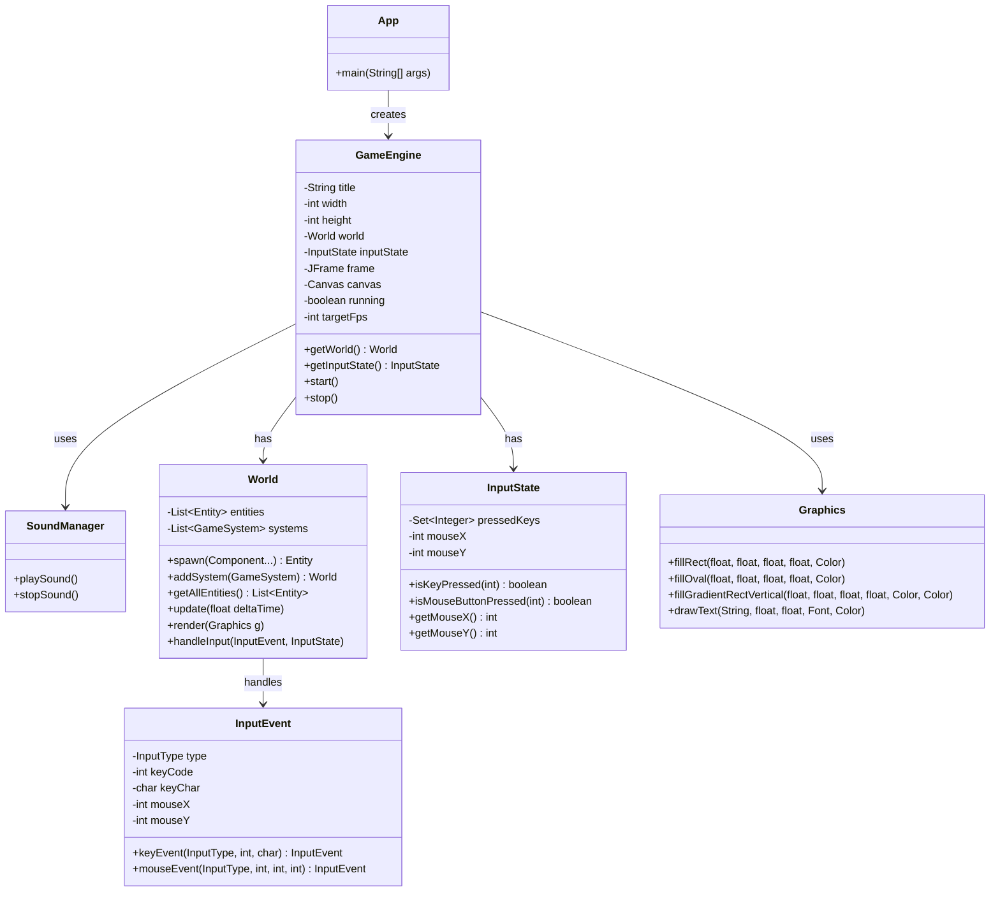

# App & Engine クラス図

このドキュメントは、Number Runのアプリケーション層とゲームエンジンの構成を示します。

## 概要

- **App**: アプリケーションのエントリーポイント
- **GameEngine**: ゲームループとウィンドウ管理
- **SoundManager**: サウンド再生管理

## クラス図



## クラスの責務

### App
- **役割**: アプリケーションのエントリーポイント
- **責務**: 
  - GameEngineの初期化
  - Worldの構築とシステムの登録
  - ゲームの開始

### GameEngine
- **役割**: ゲームループとウィンドウ管理
- **責務**:
  - JFrame/Canvasの管理
  - ゲームループの実行（固定60fps）
  - 入力イベントのディスパッチ
  - Worldの更新と描画
  - リソース管理（画像、フォントなど）

### SoundManager
- **役割**: サウンド再生管理
- **責務**:
  - 効果音の再生・停止
  - BGMの管理
  - 音量制御

### World
- **役割**: ECSシステムの中核
- **責務**:
  - Entity（ゲームオブジェクト）の管理
  - System（ゲームロジック）の実行
  - クエリAPI（条件に合うEntityの検索）

### InputState
- **役割**: 入力状態の保持
- **責務**:
  - 現在押されているキー・マウスボタンの追跡
  - マウス座標の管理

### Graphics
- **役割**: 描画ユーティリティ
- **責務**:
  - 図形描画（矩形、円、楕円）
  - グラデーション描画
  - テキスト描画
  - Java2D APIのラッパー

## ゲームループ

```
App.main()
  ↓
GameEngine.start()
  ↓
[ゲームループ開始]
  ↓
  ├─ 入力イベント処理 → World.handleInput()
  ├─ World.update(deltaTime) → 各Systemの実行
  ├─ World.render(Graphics) → 描画
  └─ FPS調整（60fps）
  ↓
[ゲームループ終了]
```

## 初期化フロー

1. **App.main()** でGameEngineを生成
2. **World**を作成し、必要なSystemを登録
3. 初期Entityを生成（プレイヤー、UI、シーンなど）
4. **GameEngine.start()** でゲームループ開始
