# GameSystem クラス図

このドキュメントは、Number RunのECS（Entity Component System）アーキテクチャにおける**System**と**World**の構成を示します。

## 概要

- **World**: EntityとSystemを管理する中央システム
- **GameSystem**: ゲームロジックを実装するインターフェース
- **SystemPriority**: システムの実行優先度を定義

## クラス図

```mermaid
classDiagram
    direction TB
    
    %% ===== World & GameSystem =====
    class World {
        -List~Entity~ entities
        -List~GameSystem~ systems
        +spawn(Component...) Entity
        +addSystem(GameSystem) World
        +addSystems(GameSystem...) World
        +query(Class...) List~Entity~
        +getAllEntities() List~Entity~
        +update(float deltaTime)
        +render(Graphics g)
        +handleInput(InputEvent, InputState)
    }
    
    class GameSystem {
        <<interface>>
        +getPriority() int
        +update(World, float)
        +onInput(World, InputEvent, InputState)
        +onStart(World)
        +onStop(World)
    }
    
    class SystemPriority {
        <<enumeration>>
        HEIGHEST
        HIGH
        DEFAULT
        LOW
        VERY_LOW
        +getPriority() int
    }
    
    World --> GameSystem : executes
    GameSystem --> SystemPriority : uses
    
    %% ===== UI Package =====
    class InputEvent {
        -InputType type
        -int keyCode
        -char keyChar
        -int mouseX
        -int mouseY
        +keyEvent(InputType, int, char) InputEvent
        +mouseEvent(InputType, int, int, int) InputEvent
        +getType() InputType
    }
    
    class InputState {
        -Set~Integer~ pressedKeys
        -int mouseX
        -int mouseY
        +isKeyPressed(int) boolean
        +isMouseButtonPressed(int) boolean
        +getMouseX() int
        +getMouseY() int
    }
    
    class InputType {
        <<enumeration>>
        KEY_PRESSED
        KEY_RELEASED
        KEY_TYPED
        MOUSE_PRESSED
        MOUSE_RELEASED
        MOUSE_CLICKED
        MOUSE_MOVED
        MOUSE_DRAGGED
    }
    
    class Graphics {
        +fillRect(float, float, float, float, Color)
        +fillOval(float, float, float, float, Color)
        +fillGradientRectVertical(float, float, float, float, Color, Color)
        +drawText(String, float, float, Font, Color)
    }
    
    InputEvent --> InputType : uses
    World --> InputEvent : uses
    World --> InputState : uses
    
    %% ===== Game Systems =====
    class MovementSystem {
        +update(World, float)
    }
    
    class PlayerMovementSystem {
        +update(World, float)
        +onInput(World, InputEvent, InputState)
    }
    
    class PlayerPassWallSystem {
        +update(World, float)
    }
    
    class PlayerViewSyncSystem {
        +update(World, float)
    }
    
    class LevelSystem {
        +update(World, float)
    }
    
    class LaneMappingSystem {
        +update(World, float)
    }
    
    class LaneMovementSystem {
        +update(World, float)
    }
    
    class GridLineSpawnSystem {
        +update(World, float)
    }
    
    class CursorSystem {
        +update(World, float)
    }
    
    class GlobalCursorSystem {
        +update(World, float)
        +onInput(World, InputEvent, InputState)
    }
    
    class ButtonClickSystem {
        +onInput(World, InputEvent, InputState)
    }
    
    class TitleSystem {
        +update(World, float)
    }
    
    class TitleExitSystem {
        +onInput(World, InputEvent, InputState)
    }
    
    class GameOverSystem {
        +update(World, float)
    }
    
    class GameOverExitSystem {
        +update(World, float)
        +onInput(World, InputEvent, InputState)
    }
    
    class GameOverAdSystem {
        +update(World, float)
    }
    
    class DamageEffectSystem {
        +update(World, float)
    }
    
    class PowerUpEffectSystem {
        +update(World, float)
    }
    
    class SpriteAnimationSystem {
        +update(World, float)
    }
    
    class ObstacleRotateSystem {
        +update(World, float)
    }
    
    class ObstacleWobbleSystem {
        +update(World, float)
    }
    
    class PlayerHitObstacleSystem {
        +update(World, float)
    }
    
    MovementSystem ..|> GameSystem : implements
    PlayerMovementSystem ..|> GameSystem : implements
    PlayerPassWallSystem ..|> GameSystem : implements
    PlayerViewSyncSystem ..|> GameSystem : implements
    LevelSystem ..|> GameSystem : implements
    LaneMappingSystem ..|> GameSystem : implements
    LaneMovementSystem ..|> GameSystem : implements
    GridLineSpawnSystem ..|> GameSystem : implements
    CursorSystem ..|> GameSystem : implements
    GlobalCursorSystem ..|> GameSystem : implements
    ButtonClickSystem ..|> GameSystem : implements
    TitleSystem ..|> GameSystem : implements
    TitleExitSystem ..|> GameSystem : implements
    GameOverSystem ..|> GameSystem : implements
    GameOverExitSystem ..|> GameSystem : implements
    GameOverAdSystem ..|> GameSystem : implements
    DamageEffectSystem ..|> GameSystem : implements
    PowerUpEffectSystem ..|> GameSystem : implements
    SpriteAnimationSystem ..|> GameSystem : implements
    ObstacleRotateSystem ..|> GameSystem : implements
    ObstacleWobbleSystem ..|> GameSystem : implements
    PlayerHitObstacleSystem ..|> GameSystem : implements
```

## システム分類

### コアシステム
- **MovementSystem**: Transform + Velocity による移動処理

### プレイヤーシステム
- **PlayerMovementSystem**: プレイヤーの移動（入力処理）
- **PlayerPassWallSystem**: プレイヤーと壁の衝突判定・演算処理
- **PlayerViewSyncSystem**: プレイヤー状態と描画の同期

### レベル・レーンシステム
- **LevelSystem**: レベル進行とスピード調整
- **LaneMappingSystem**: レーン座標系のマッピング
- **LaneMovementSystem**: レーン上のオブジェクト移動
- **GridLineSpawnSystem**: グリッド線の生成と管理

### UI・入力システム
- **CursorSystem**: カーソル追従
- **GlobalCursorSystem**: グローバルカーソル位置管理
- **ButtonClickSystem**: ボタンクリック処理

### シーンシステム
- **TitleSystem**: タイトル画面の更新
- **TitleExitSystem**: タイトル画面の終了処理
- **GameOverSystem**: ゲームオーバー画面の更新
- **GameOverExitSystem**: ゲームオーバー画面の終了処理
- **GameOverAdSystem**: ゲームオーバー広告の制御

### エフェクト・アニメーション・障害物システム
- **DamageEffectSystem**: ダメージエフェクトの処理
- **PowerUpEffectSystem**: パワーアップエフェクトの処理
- **SpriteAnimationSystem**: スプライトアニメーション
- **ObstacleRotateSystem**: 障害物の回転
- **ObstacleWobbleSystem**: 障害物の左右往復動作
- **PlayerHitObstacleSystem**: プレイヤーと障害物の衝突判定

## システムの実行順序

システムは`SystemPriority`に基づいて実行されます：
1. **HIGHEST**: 最優先（入力処理など）
2. **HIGH**: 高優先度（プレイヤー移動など）
3. **DEFAULT**: 通常優先度（ほとんどのシステム）
4. **LOW**: 低優先度（エフェクトなど）
5. **VERY_LOW**: 最低優先度（レンダリング同期など）
